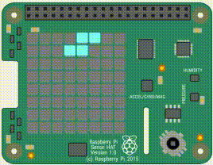

# Tetris
Game for Raspberry Pi with SenseHat extension, implemented in Python.
Use the SenseHat joystick to shift blocks (left / right), to rotate blocks (up / down) and to drop blocks (middle).
Make sure to position your blocks well - every mistake will be painful, as there is not much space on a SenseHat display!

	

Execution: 
<code>
python tetris.py
</code>
  
